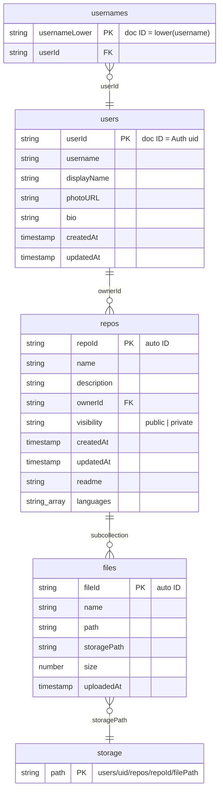
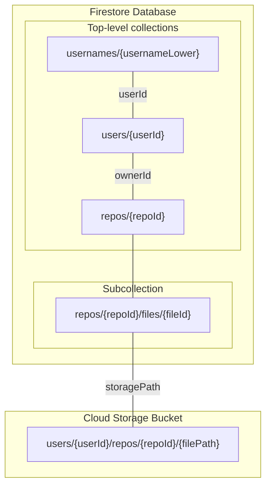

# Data schema and structure

Single source of truth. TypeScript types in `src/types/schema.ts`.

---

## All collections (complete list)

**Firestore (3 top-level collections + 1 subcollection):**

| # | Collection path | Type | Document ID | Purpose |
|---|-----------------|------|-------------|---------|
| 1 | `users/{userId}` | Top-level | Firebase Auth `uid` | User profile (username, displayName, photoURL, bio, timestamps) |
| 2 | `usernames/{usernameLower}` | Top-level | `username.toLowerCase()` | Unique username → userId lookup; public profile route |
| 3 | `repos/{repoId}` | Top-level | Auto-generated | Repo metadata (name, description, ownerId, visibility, readme, languages, timestamps) |
| 4 | `repos/{repoId}/files/{fileId}` | Subcollection of `repos` | Auto-generated | File metadata (name, path, storagePath, size, uploadedAt) |

**Cloud Storage (not a collection; path pattern):**

- Path pattern: `users/{userId}/repos/{repoId}/{filePath}` (objects, not documents).

---

## Diagrams

### Diagram A – High-level structure and relationships



### Diagram B – Firestore + Storage paths (hierarchy)



---

## Firestore rules (full)

Source: `firestore.rules`. Complete contents:

```javascript
rules_version = '2';
service cloud.firestore {
  match /databases/{database}/documents {
    function isOwner(ownerId) {
      return request.auth != null && request.auth.uid == ownerId;
    }
    function isPublic() {
      return resource.data.visibility == 'public';
    }
    match /users/{userId} {
      allow read: if true;
      allow create: if request.auth != null && request.auth.uid == userId;
      allow update, delete: if request.auth != null && request.auth.uid == userId;
    }
    match /usernames/{username} {
      allow read: if true;
      allow create: if request.auth != null;
      allow update, delete: if request.auth != null;
    }
    match /repos/{repoId} {
      allow read: if isPublic() || isOwner(resource.data.ownerId);
      allow create: if request.auth != null && request.resource.data.ownerId == request.auth.uid;
      allow update, delete: if request.auth != null && resource.data.ownerId == request.auth.uid;
      match /files/{fileId} {
        allow read: if get(/databases/$(database)/documents/repos/$(repoId)).data.visibility == 'public' || request.auth != null && get(/databases/$(database)/documents/repos/$(repoId)).data.ownerId == request.auth.uid;
        allow create: if request.auth != null && get(/databases/$(database)/documents/repos/$(repoId)).data.ownerId == request.auth.uid;
        allow update, delete: if request.auth != null && get(/databases/$(database)/documents/repos/$(repoId)).data.ownerId == request.auth.uid;
      }
    }
  }
}
```

**Per-collection summary:**

- **users/{userId}:** read: all; create: auth and doc ID = auth.uid; update/delete: auth and doc ID = auth.uid.
- **usernames/{username}:** read: all; create/update/delete: any authenticated user.
- **repos/{repoId}:** read: repo is public OR requester is owner; create: auth and `ownerId == auth.uid`; update/delete: auth and owner.
- **repos/{repoId}/files/{fileId}:** read: parent repo public OR requester is repo owner; create/update/delete: repo owner only (via `get(repos/repoId)`).

---

## Storage rules (full)

Source: `storage.rules`. Complete contents:

```javascript
rules_version = '2';
service firebase.storage {
  match /b/{bucket}/o {
    function isOwner(ownerId) {
      return request.auth != null && request.auth.uid == ownerId;
    }
    function pathMatches(path, pattern) {
      return path.matches(pattern);
    }
    match /users/{userId}/repos/{repoId}/{allPaths=**} {
      allow read: if true;
      allow write: if request.auth != null && request.auth.uid == userId
        && !pathMatches(allPaths, '.*node_modules.*')
        && !pathMatches(allPaths, '.*\\.env.*');
    }
  }
}
```

**Summary:** Read: all. Write: only when `request.auth.uid == userId` and path does not match `.*node_modules.*` or `.*\.env.*`.

---

## Indexes

This codebase relies on **Firestore’s automatic single-field indexes** for its current queries (recommended). That means `firestore.indexes.json` does **not** need to define any composite indexes today.

### Current `firestore.indexes.json` (deployed)

```json
{
  "indexes": [],
  "fieldOverrides": []
}
```

### What queries are currently used (and how they’re indexed)

- **Explore:** `where("visibility", "==", "public")` (and then sorted by `createdAt` **client-side** in JavaScript)\n  - Uses automatic single-field index on `repos.visibility`.
- **Dashboard:** `where("ownerId", "==", ownerId)`\n  - Uses automatic single-field index on `repos.ownerId`.

### Optional future composite index (only if Explore switches to server-side ordering)

If you later change Explore to query like:\n`where("visibility", "==", "public").orderBy("createdAt", "desc")`\nthen you will need this composite index:

```json
{
  \"indexes\": [
    {
      \"collectionGroup\": \"repos\",
      \"queryScope\": \"COLLECTION\",
      \"fields\": [
        { \"fieldPath\": \"visibility\", \"order\": \"ASCENDING\" },
        { \"fieldPath\": \"createdAt\", \"order\": \"DESCENDING\" }
      ]
    }
  ],
  \"fieldOverrides\": []
}
```

---

## Relationships

- **users 1 ──< repos (many):** One user (owner) has many repos; `repos.ownerId` → `users/{userId}`.
- **usernames N ──> 1 users:** Many usernames (doc IDs) point to one user via `userId`; one document per username (lowercase).
- **repos 1 ──< files (many):** One repo has many file metadata docs in subcollection `repos/{repoId}/files`.
- **files 1 ──> Storage object:** Each file doc's `storagePath` points to exactly one blob in Storage.

---

## Firestore – users

- **Path:** `users/{userId}` (document ID = Firebase Auth uid)
- **Fields:**

| Field | Type | Required | Notes |
|-------|------|----------|-------|
| username | string | yes | Unique; mirrored in `usernames` |
| displayName | string | no | |
| photoURL | string | no | |
| bio | string | no | |
| createdAt | Timestamp | no | serverTimestamp on create |
| updatedAt | Timestamp | no | serverTimestamp on update |

- **Rules:** read all; create/update/delete only when `request.auth.uid == userId`. See **Firestore rules (full)** above.

---

## Firestore – usernames

- **Path:** `usernames/{usernameLower}` (document ID = `username.toLowerCase()` from `users`)
- **Fields:**

| Field | Type | Required | Notes |
|-------|------|----------|-------|
| userId | string | yes | References `users/{userId}` |

- **Purpose:** Unique username lookup; resolve `/:username` to user; `isUsernameAvailable`.
- **Rules:** read all; create/update/delete only when authenticated. See **Firestore rules (full)** above.
- **Consistency:** On create/update of `users` profile, write or delete `usernames/{lower}` and keep in sync.

---

## Firestore – repos

- **Path:** `repos/{repoId}` (auto-generated ID)
- **Fields:**

| Field | Type | Required | Notes |
|-------|------|----------|-------|
| name | string | yes | Trimmed |
| description | string | no | Optional, trimmed |
| ownerId | string | yes | References `users/{userId}` |
| visibility | 'public' \| 'private' | yes | Used in rules and Explore |
| createdAt | Timestamp | yes | serverTimestamp on create |
| updatedAt | Timestamp | no | serverTimestamp on update |
| readme | string | no | Rendered on repo detail |
| languages | string[] | no | Auto-detected on upload; filter Explore |

- **Rules:** read if `visibility == 'public'` OR `request.auth.uid == ownerId`; create only if `ownerId == request.auth.uid`; update/delete only if owner. See **Firestore rules (full)** above.
- **Indexes:** Current queries rely on **automatic single-field indexes** (see **Indexes** above). Explore sorts by `createdAt` client-side, so no composite index is required unless you move ordering into the Firestore query.

---

## Firestore – repos/{repoId}/files

- **Path:** `repos/{repoId}/files/{fileId}` (subcollection; auto-generated document ID)
- **Fields:**

| Field | Type | Required | Notes |
|-------|------|----------|-------|
| name | string | yes | File name (e.g. from path or File.name) |
| path | string | yes | Logical path in repo (e.g. `src/index.js`) |
| storagePath | string | yes | Full Storage path; must match buildStoragePath |
| size | number | no | File size in bytes |
| uploadedAt | Timestamp | no | serverTimestamp on upload |

- **Rules:** Same as parent repo (read if repo public or user is owner; create/update/delete only repo owner). See **Firestore rules (full)** above.
- **Relationship:** `storagePath` = `users/{ownerId}/repos/{repoId}/{path}` (see `src/types/schema.ts` `buildStoragePath`).

---

## Cloud Storage

- **Path pattern:** `users/{userId}/repos/{repoId}/{filePath}`
  - `filePath`: logical path, no leading slash (e.g. `src/index.js`, `README.md`).
- **Rules:** See **Storage rules (full)** above. Read: all. Write: only when `request.auth.uid == userId` and path does not match `.*node_modules.*` or `.*\.env.*`.
- **Consistency:** Each `repos/{repoId}/files/{fileId}` doc stores `storagePath` pointing to this path; upload flow in `src/lib/files.ts` uses `buildStoragePath(userId, repoId, filePath)`.
